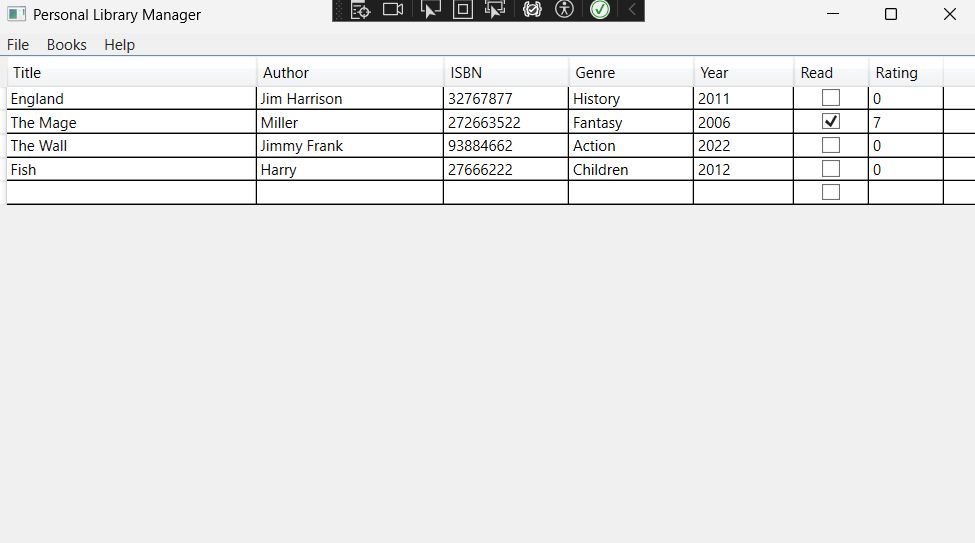
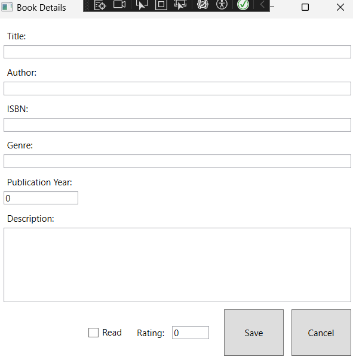
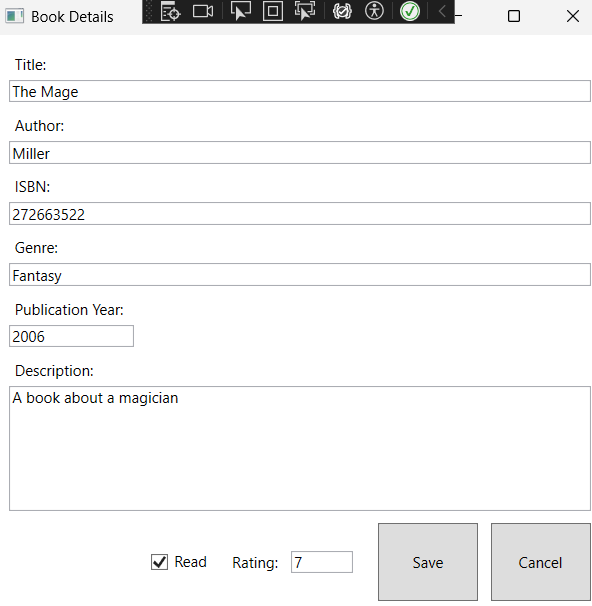

# 7. Интерфейс приложения (Application Interface)
Главное окно приложения представляет собой список книг (DataGrid) с панелью управления (кнопки "Добавить", "Редактировать", "Удалить").

Окно добавления/редактирования книги содержит поля для ввода названия, года, и выпадающие списки для выбора Автора и Жанра.

